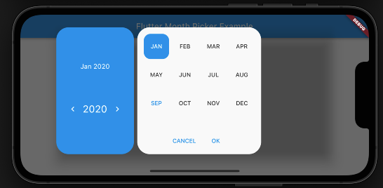

# Flutter Month Picker

Flutter month picker package lets you to choose month and year only and implement in your app.

## Installation

1. Add the latest verstion of package to your pubspec.yaml

```yaml
dependencies:
  flutter_month_picker: ^0.0.1
```

OR just run `flutter pub add month_year_picker` using your preferred terminal app.

2. Run

```
    flutter pub get
```

3. Import the package and use it in your Flutter app.

```
import 'package:flutter_month_picker/flutter_month_picker.dart';
```

4. Usage in Code

```dart
final selected = await showMonthPicker(
    context: context,
    initialDate: DateTime.now(),
    firstDate: DateTime(2000),
    lastDate: DateTime(2050),
  );
```

## Parameters

| Parameters  |                                                                                                                                   Description                                                                                                                                    |
| ----------- | :------------------------------------------------------------------------------------------------------------------------------------------------------------------------------------------------------------------------------------------------------------------------------: | ----- |
| context     |                                                                                                  Must not be null. Will be passed to the internal showMonthPicker funtion call                                                                                                   | $1600 |
| initialDate | Must not be `null` and must fall between the `firstDate` and `lastDate`. The `initialDate` will be truncated to its `year` and `month` components. When the month/year picker is first displayed, it will show the month/year of the `initialDate`, with `initialDate` selected. |
| firstDate   |                                                                      Must not be `null`. The `firstDate` will be truncated to its `year` and `month` components. This is the earliest allowable month/year.                                                                      |
| lastDate    |                                                                       Must not be `null`. The `lastDate` will be truncated to its `year` and `month` components. This is the latest allowable month/year.                                                                        |

## Screenshot

| Mode           | Screenshot                     |
| -------------- | ------------------------------ |
| Portrait mode  |   |
| Landscape mode |  |

## Next Goals

- [ ] More customization like: size, color, textstyles, localizaton, platform.
- [ ] Implentation of lcoalization.
- [ ] Cross-platform (Android and IOS) UI.
